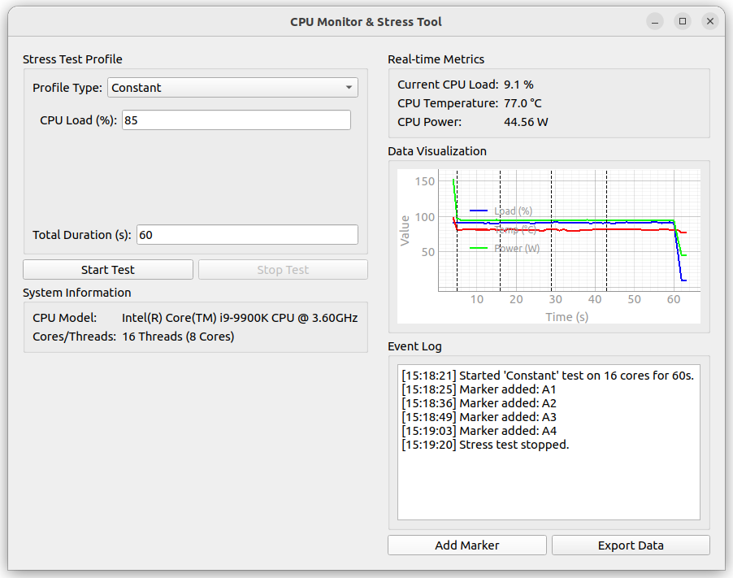

# CPU Monitor & Stress Tool

A small performance-testing repository with two independent paths:

- a Linux PyQt GUI for controllable CPU load and live CPU monitoring;
- standalone Python CLIs for CPU stress and adaptive NVIDIA GPU stress.

The existing repository name is retained even though GPU support is now included.



---

## Features

### CPU GUI

- **Load profiles**
  - **Constant**: maintain a fixed load percentage.
  - **Pulsed**: alternate between high and low load.
  - **Ramp**: linearly increase load to observe dynamic response.
- **Real-time monitoring**
  - CPU load
  - CPU temperature
  - CPU power through Intel RAPL (`/sys/class/powercap/...`)
- CSV export and event markers
- CPU model and core/thread information

### CPU CLI

`cpu_stress_cli.py` provides the same constant, pulsed, and ramp concepts without importing the Qt application.

### NVIDIA GPU CLI

`gpu_stress_cli.py` is an adaptive, low-VRAM NVIDIA stress runner:

- `--load 0..100` with NVML utilization feedback when available;
- synchronized duty-cycle fallback when utilization telemetry is unavailable;
- backend fallback: PyTorch/cuBLAS → CuPy/cuBLAS → Numba CUDA kernel;
- reusable compute-heavy buffers instead of continuously allocating VRAM;
- automatic matrix downsizing after allocation failure;
- constant, pulsed, and ramp profiles;
- temperature pause/resume guard;
- live utilization, temperature, power, clocks, and VRAM status;
- optional CSV telemetry export;
- Linux and Windows support wherever the selected CUDA Python backend works.

See [docs/GPU_STRESS.md](docs/GPU_STRESS.md) for the complete GPU guide and [docs/DEVELOPMENT.md](docs/DEVELOPMENT.md) for implementation notes.

---

## Installation and usage

### CPU GUI from source

```bash
git clone https://github.com/PME26Elvis/CPU-Monitor-Stress-Tool.git
cd CPU-Monitor-Stress-Tool
python3 -m venv venv
source venv/bin/activate
pip install -r requirements.txt
python main.py
```

CPU GUI dependencies:

- PyQt5
- psutil >= 5.8.0
- pyqtgraph
- py-cpuinfo
- numpy

### CPU CLI

```bash
python cpu_stress_cli.py --duration 60 --load 75
python cpu_stress_cli.py --duration 120 --profile ramp --start-load 10 --end-load 100
```

### NVIDIA GPU CLI

Recommended installation:

```bash
python -m venv .venv
source .venv/bin/activate  # Windows PowerShell: .venv\Scripts\Activate.ps1
pip install -r requirements-gpu.txt
```

List GPUs and validate the selected backend:

```bash
python gpu_stress_cli.py --list-gpus
python gpu_stress_cli.py --diagnose
```

Run a 10-minute test targeting approximately 80% total GPU utilization:

```bash
python gpu_stress_cli.py --duration 600 --load 80
```

Run full compute load with CSV logging:

```bash
python gpu_stress_cli.py \
  --duration 900 \
  --load 100 \
  --csv results/gpu-full.csv
```

The default `--memory-mib 256` is an upper budget. The actual three-buffer GEMM allocation is smaller and retains additional CUDA/cuBLAS workspace headroom.

---

## Intel RAPL permissions

By default, reading `/sys/class/powercap/intel-rapl:*` may require root. To allow a normal user to read CPU power:

```bash
# 1) Make RAPL readable for the "power" group
echo 'SUBSYSTEM=="powercap", KERNEL=="intel-rapl:*", MODE="0644", GROUP="power"' | \
sudo tee /etc/udev/rules.d/90-intel-rapl.rules

# 2) Add your user to the group
sudo groupadd -f power
sudo usermod -aG power $USER

# 3) Reload and trigger udev, then re-login or reboot
sudo udevadm control --reload
sudo udevadm trigger
```

If the GUI must be run with sudo, preserve desktop environment variables:

```bash
sudo -E env XDG_RUNTIME_DIR=/run/user/$(id -u) ./CPU-Monitor-Stress-Tool
```

---

## How it works

### CPU path

- GUI and plotting: PyQt5 + pyqtgraph
- system metrics: psutil + py-cpuinfo
- CPU power: Intel RAPL SysFS energy counters
- load generation: multiprocessing workers with busy-wait loops tuned by a shared value

### GPU path

- monitoring: NVML Python binding, then `nvidia-smi` CSV fallback
- primary workload: cuBLAS GEMM through PyTorch or CuPy
- final compute fallback: custom Numba CUDA arithmetic kernel
- load shaping: calibrated synchronous chunks plus a long-term work-credit scheduler
- adaptive mode: EMA-filtered PI correction from measured GPU utilization
- memory protection: reserved free VRAM, preallocated output buffers, and OOM downsizing

A GPU utilization target is not the same as a board-power target. Instruction mix, Tensor Core support, display activity, power caps, laptop dynamic power, and thermal throttling can change power draw at the same utilization reading.

---

## Build the CPU GUI as a standalone binary

```bash
pip install pyinstaller
pyi-makespec --onefile --name CPU-Monitor-Stress-Tool --paths . main.py
```

In the generated `.spec`, add:

```python
hiddenimports=['main_window', 'stress_test']
```

Build:

```bash
pyinstaller CPU-Monitor-Stress-Tool.spec --clean
```

The binary appears under `dist/`.

---

## CSV formats

### CPU GUI

```text
Time (s), CPU Load (%), Temperature (C), Power (W)
...
--- Event Markers ---
Time (s), Event
<seconds>, <text>
```

### GPU CLI

The GPU CSV includes elapsed time, profile target, commanded duty, thermal state, backend/workload metadata, resident workload memory, chunk duration, GPU/memory utilization, temperature, power, clocks, and VRAM totals.

---

## Validation

CPU-only checks do not install CUDA dependencies:

```bash
python -m py_compile cpu_stress_cli.py gpu_stress_cli.py
python -m unittest discover -s tests -v
python gpu_stress_cli.py --help
```

A GitHub Actions workflow runs those checks on Python 3.10 and 3.12.

GPU smoke test:

```bash
python gpu_stress_cli.py --diagnose
python gpu_stress_cli.py --duration 15 --load 25
python gpu_stress_cli.py --duration 30 --load 100 --csv gpu-smoke.csv
```

---

## Troubleshooting

### CPU power shows N/A

RAPL counters are unavailable or not readable. Apply the udev rule above, re-login, or try sudo.

### Qt platform plugin xcb error

```bash
sudo apt-get update
sudo apt-get install -y libxcb-cursor0 libxkbcommon-x11-0 libglu1-mesa
```

### GPU CLI says no backend could start

Install the recommended GPU requirements, then run `python gpu_stress_cli.py --diagnose`. The error lists every attempted backend and its failure reason. A CPU-only PyTorch build does not provide a CUDA backend.

### GPU utilization does not match `--load` exactly

Use a run longer than a few driver sampling windows. Keep `--control auto` or force `--control feedback`. Other graphics/compute processes affect device-wide utilization. On MIG or unsupported telemetry, use `--control duty`.

### CUDA_VISIBLE_DEVICES points monitoring at the wrong card

Pass the CUDA-visible index to `--device` and the physical NVML index to `--monitor-device`.

### Temperature repeatedly enters THERMAL-PAUSE

Improve cooling, lower `--load`, or set a different `--temp-limit`. Do not disable the guard for unattended testing.

---

## Contributing

- Keep optional CUDA imports lazy so CPU-only tests remain usable.
- Add unit coverage for pure scheduling, parsing, profile, or controller changes.
- Test GPU changes with `--diagnose`, a low-load run, and a full-load run.
- Large behavioral changes should update `docs/GPU_STRESS.md` and `docs/DEVELOPMENT.md`.

---

## License

MIT
